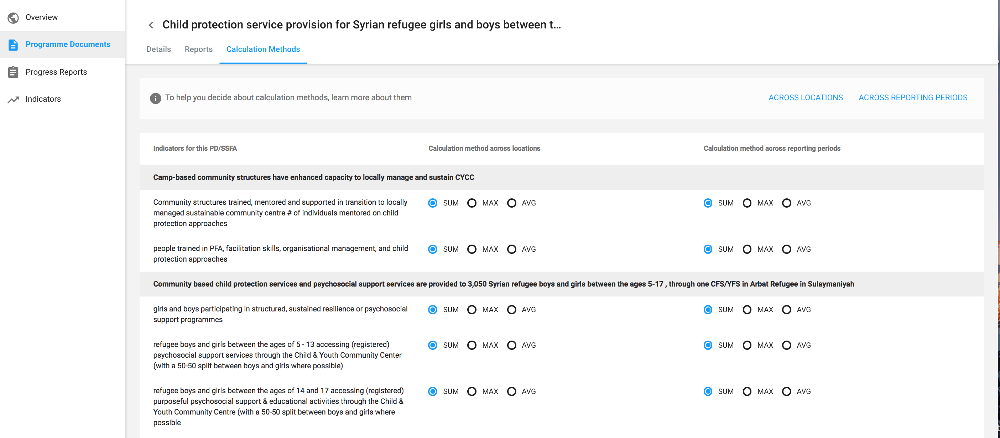
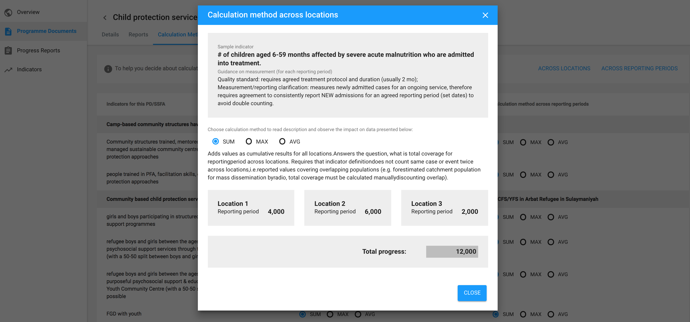
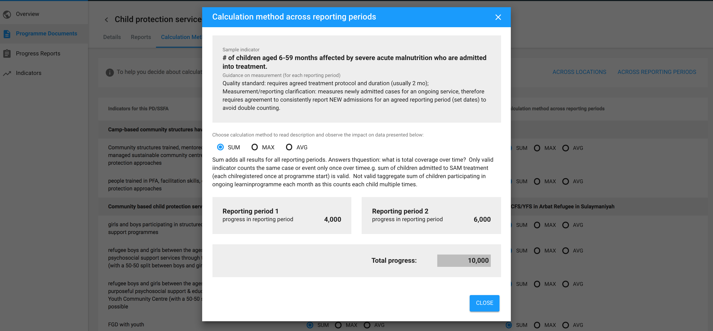

# Cluster Indicators

Indicators in a cluster can belong to following entities:

* Cluster Objective
* Cluster Activity
* Partner Project
* Project Activity: Either one of these
  * Custom
  * Associated with Cluster activity

### Creation Modal

The following represents a indicator creation and its fields. Please note that baseline, target and in-need can be associated at a location level.

**Note**: \#1/4/7 change requests are somewhat starting to be addressed here:

### Helper Text &lt;TBD&gt;

When looking at an indicator, the user can click on the 'i' for helper text.

Users can see examples across Locations and Reporting periods

