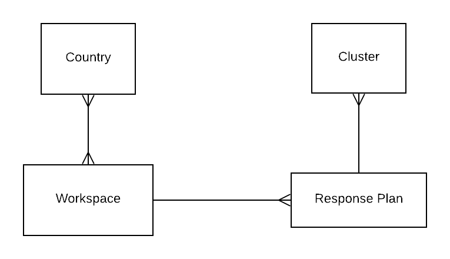

# Overview

### Core Data Concepts

Below a visual representation of the core data concepts relating to cluster reporting.  A workspace consists of one or more countries. Each workspace then can have one or more response plans. And each response plan will have one or more clusters associated with it.

