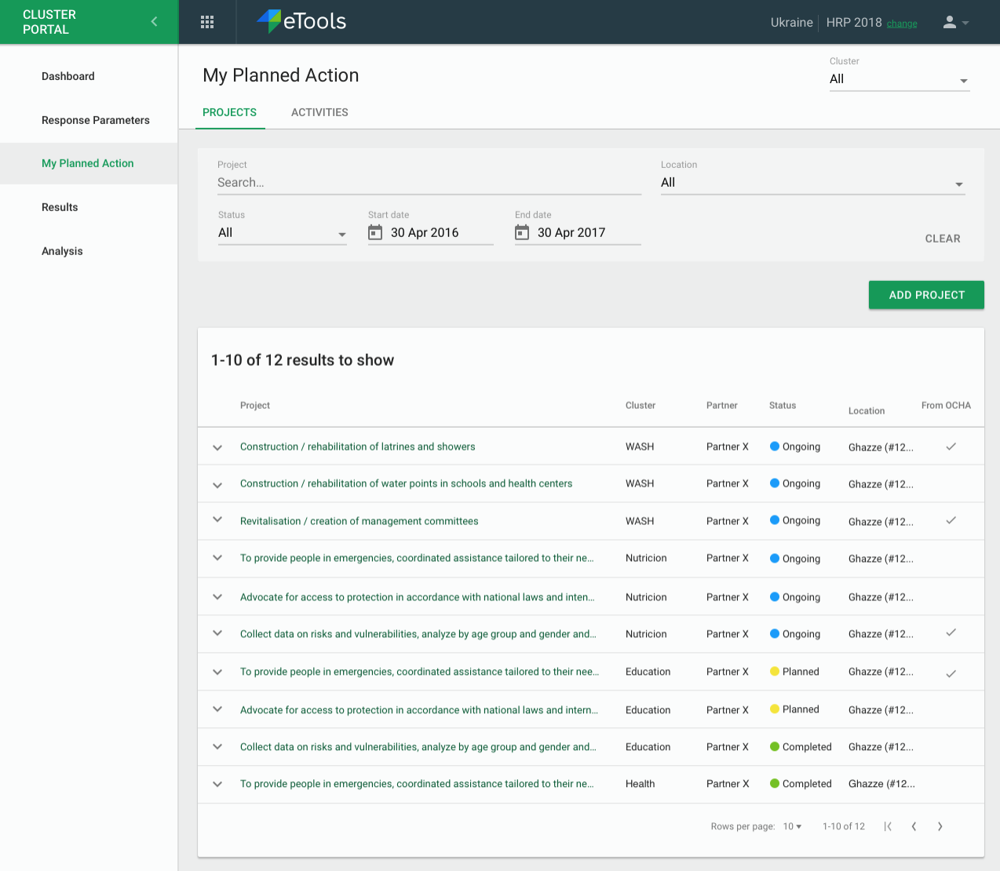
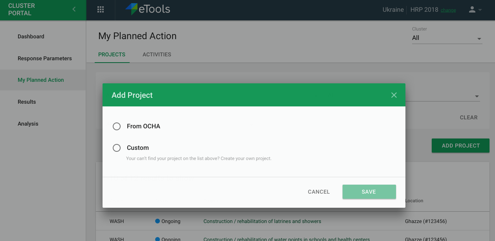
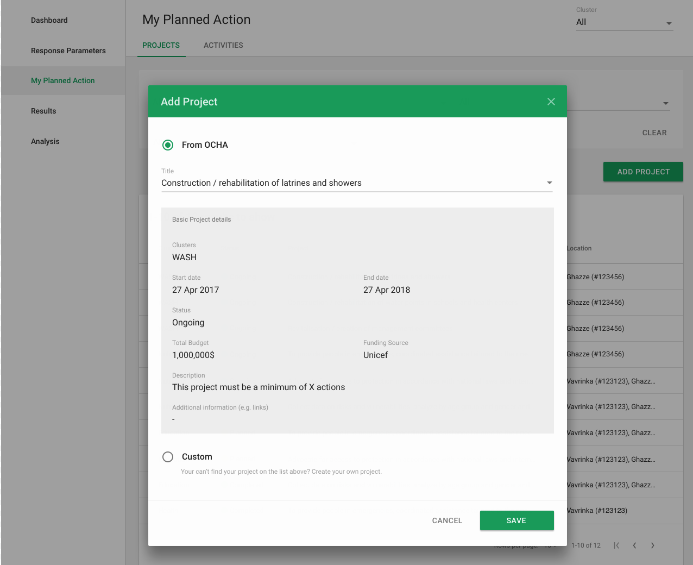
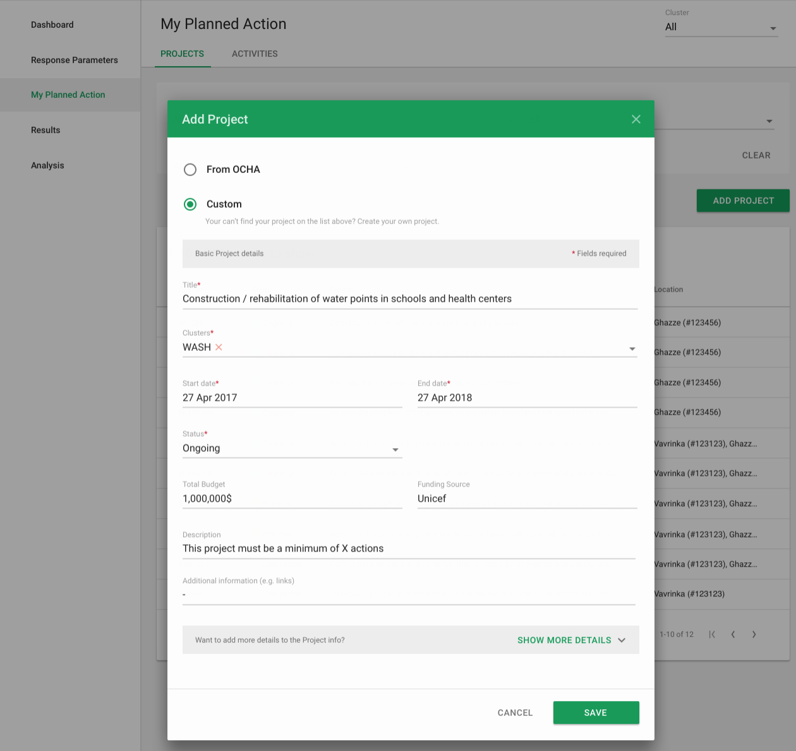
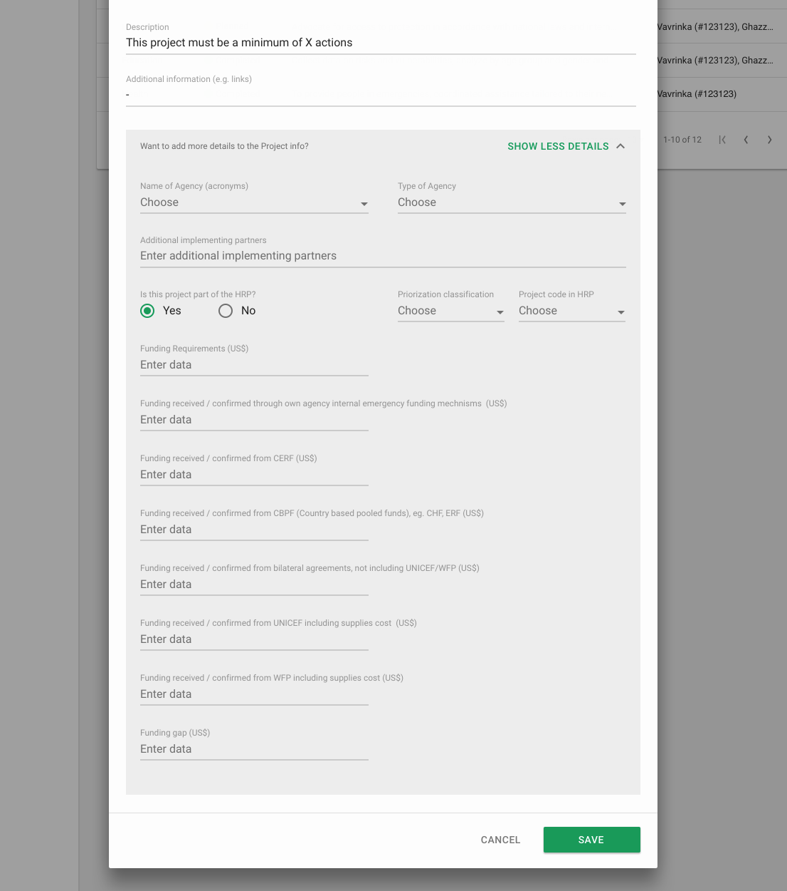
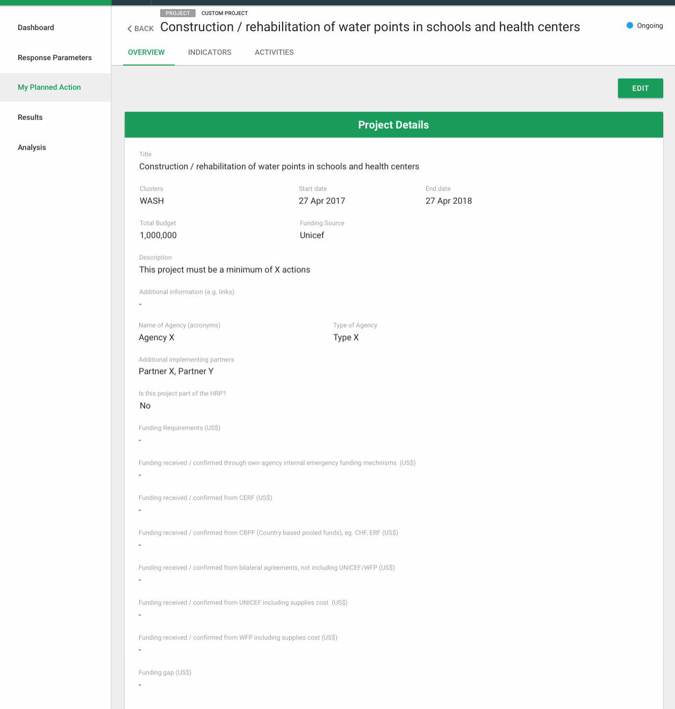
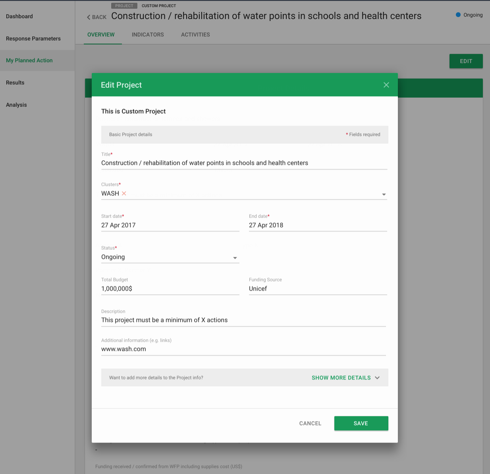
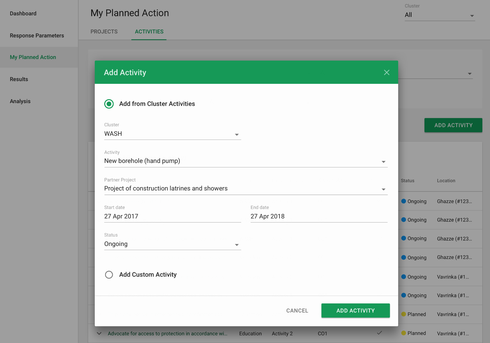
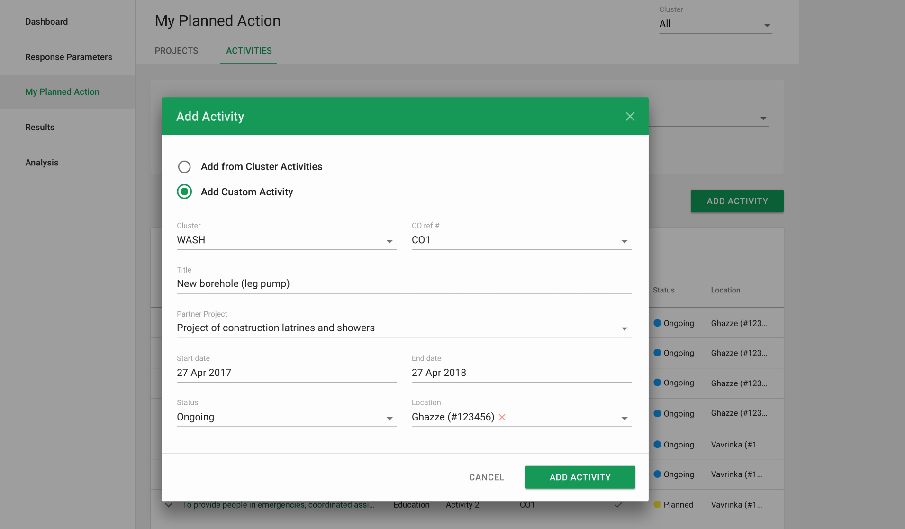
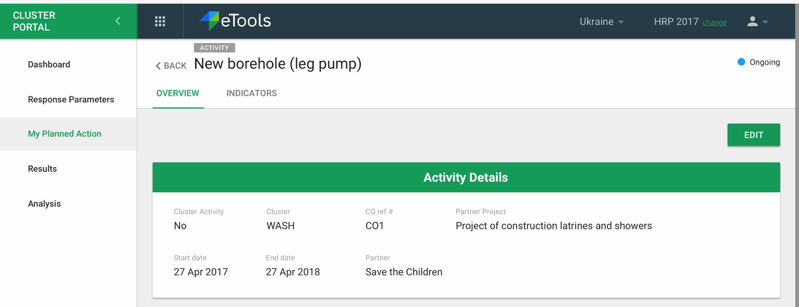

# Planning your action as a Partner

In this section \("My Planned Action" in the left hand navigation\) of the interface is where the partner can view and setup their planned actions to support the work of the cluster. This section is only visible to a partner user who is logged in. A checkmark will indicate whether a project is from OCHA. The IMO does not see this section.

Partners can add custom Projects here or pull from OCHA. 

We will show basic details in a drop down so the partner knows which project they are pulling from OCHA. 

&lt;\( **TBD** **Details need to be confirmed by Maciej\)&gt;**

Custom Project will need to have 

* Title
* Clusters \(dropdown\)
* Start Date/End Date
* Status \(dropdown\)
* Description
* &lt;**TBD Need to add:** _**Add Additional Information Field&gt;**_
* And options for see more

**&lt; TBD update image to include add additional field information&gt;**

The project details can be editable.

### 

### Project Activities

Under activities the partner can add activities they are conducting. They can choose to adopt a cluster activity or create a custom activity of their own.

If the Partner selects from a Cluster Activity, we will to show

* Cluster \(dropdown\)
* Activity \(dropdown\)
* Partner Project \(dropdown\)
* Start/End date
* Status \(dropdown\)

For Custom Activity, Partner will include

* Cluster \(dropdown\)
* Activity \(dropdown\)
* Partner Project \(dropdown\)
* Start/End date
* Status \(dropdown\)
* _**&lt;Location? \(TBD\)&gt;**_

Partner can edit project afterwards and hide details

  

