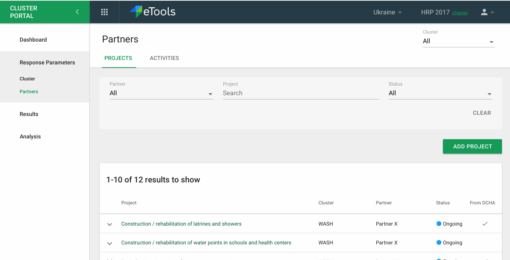
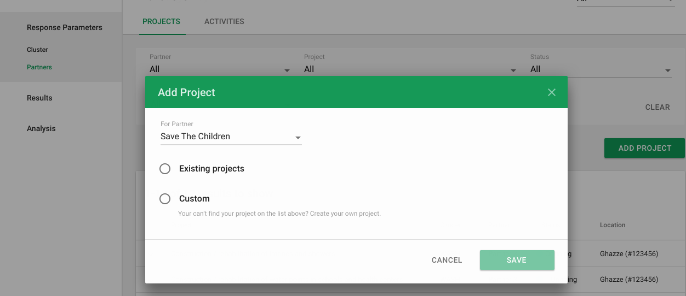
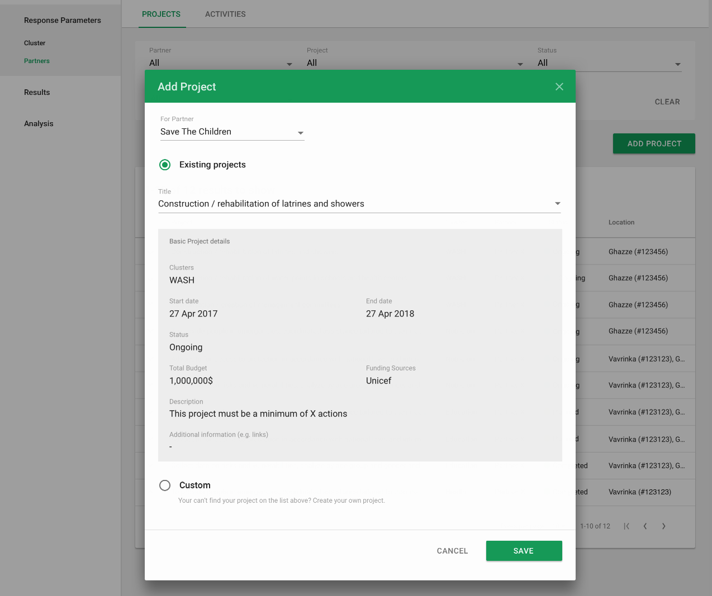
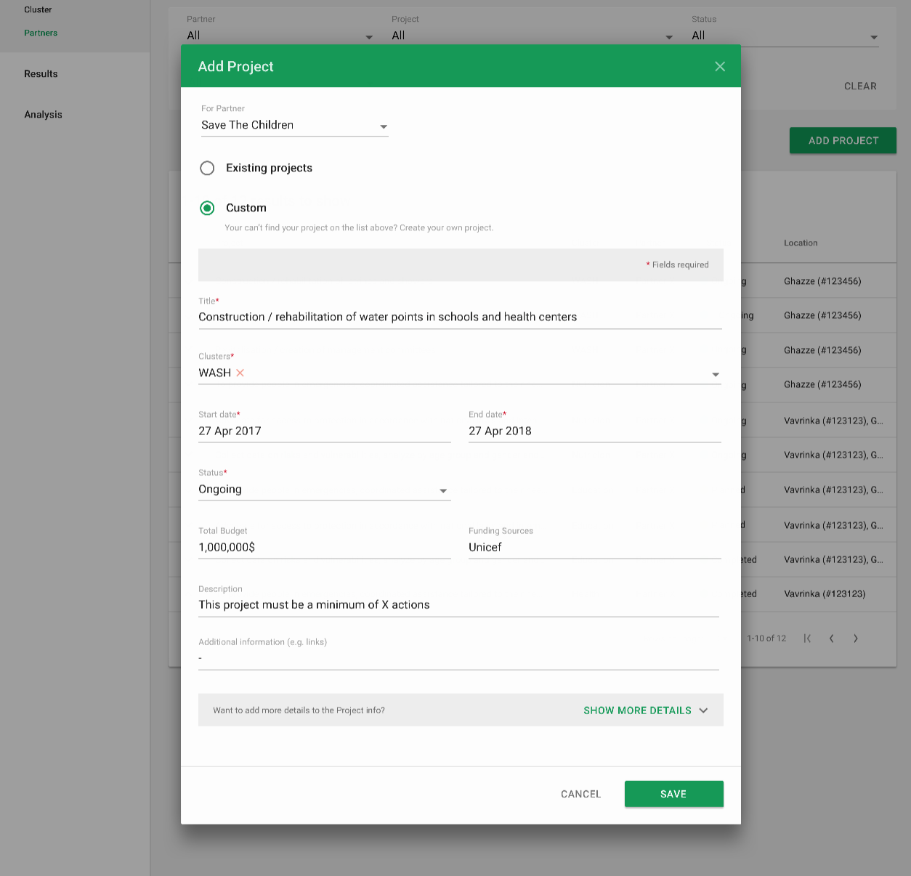
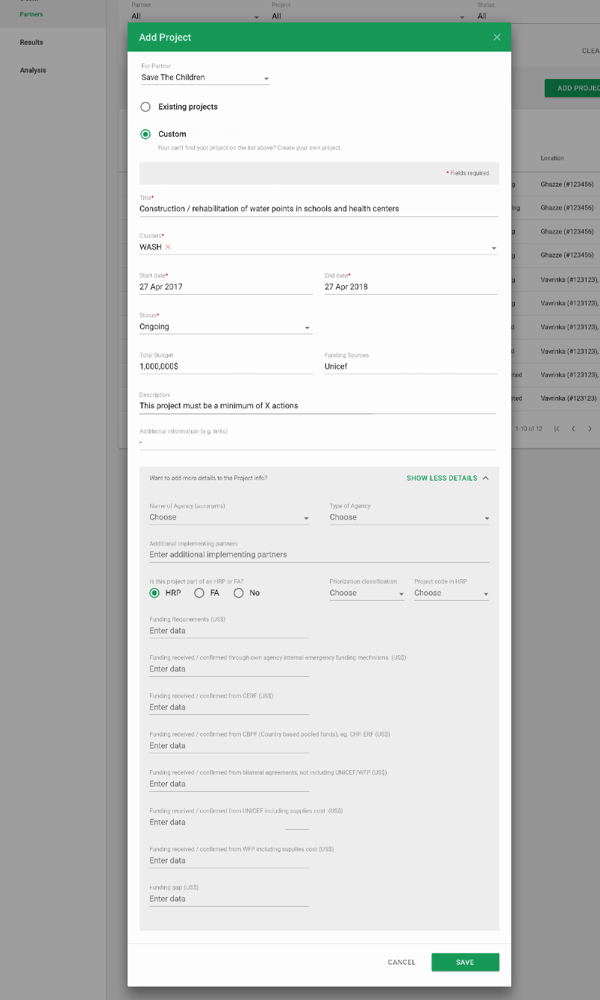
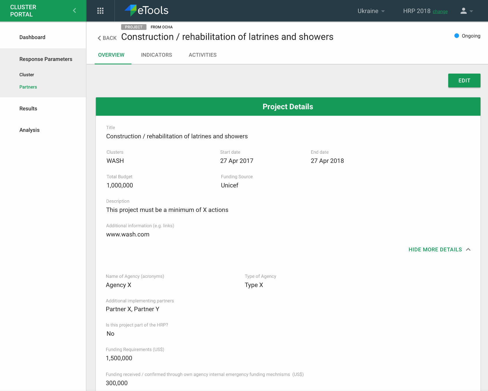
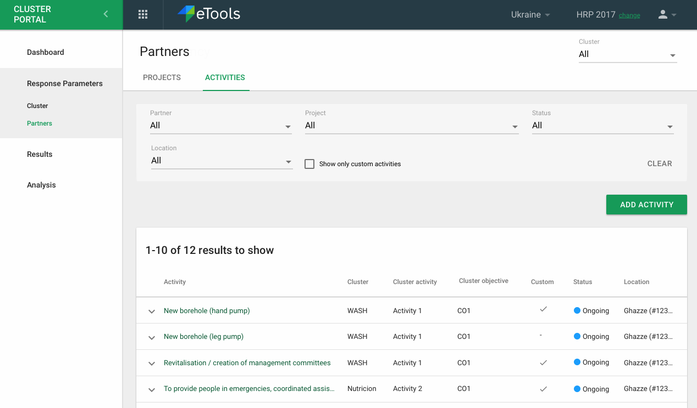
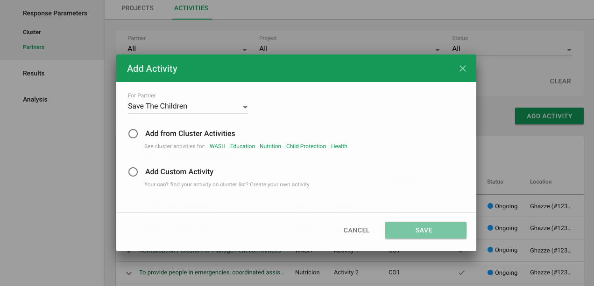
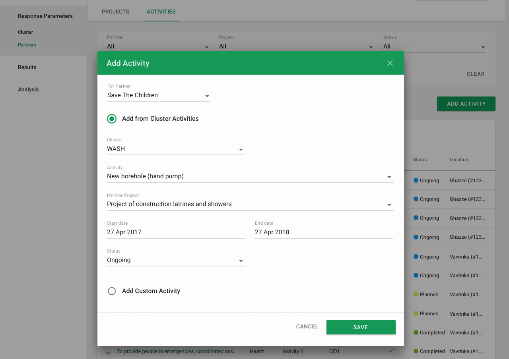
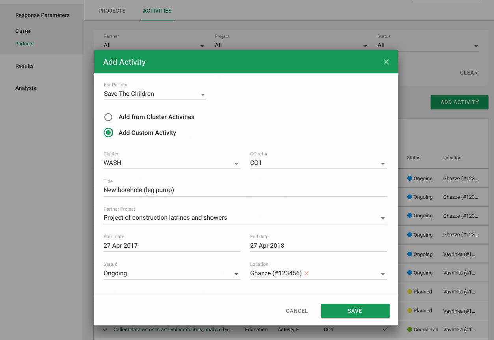

# Response Parameters setup

In this section \("Response Parameters" in the left hand navigation\) of the interface all the response parameters of this response plan can be viewed. These are the cluster objectives, cluster activities, partner projects and partner activities, along with the indicators that are associated with it.

At the top left one can select which cluster they'd like to view all the data for. There are other filters available on each list view as well.

### Clusters

Cluster objectives and activities are the primary component here. Along with Disaggregations. The IMO can create any of these, partners can view this data.

Disaggregations lets the IMO create in one place, ways in which indicator report data can be disaggregated for the entire response plan.

### Partners

This represents a place where any signed in user can view all partner projects and activities for this response plan.

### Adding a Project for a Partner as an IMO

IMO can add a project for partners \(within their cluster?\) from the response parameter section.

IMO chooses the partner and if the project is existing to be pulled from OCHA or a new custom project.

If the IMO pulls a project from OCHA, they will be able to choose from a list of projects pertaining to that partner and see details for that project.

If the IMO chooses a custom project, they will enter mandatory details such as

* Title
* Clusters \(dropdown\)
* Start Date/End Date
* Status \(dropdown\)
* Description
* Additional Information 
* And options for see more

Optional fields include

* Name Of Agency \(dropdown of acronyms\)
* Type of Agency \(dropdown\)
* Additional implementing partners
* Project part of HP or FA \(radio button\)
* Prioritization classification \(dropdown\)
* Project code in HRP \(dropdown\)
* Funding Requirements \(in US$\)
* Funding received/confirmed from CERF \(US$\)
* Funding received / confirmed from bilateral agreements, not including UNICEF/WFP \(US$\)
* Funding received / confirmed from UNICEF including supplies cost  \(US$\)
* Funding received / confirmed from WFP including supplies cost  \(US$\)
* Funding gap \(US$\)

IMO can edit project afterwards and hide details

### Adding an Activity for a Partner as an IMO

IMO can add activities for partners \(within their cluster\).

They can select the partner and then choose to add from Cluster Activities 

If the IMO selects from a Cluster Activity, we will \(**TBD attempt\) **to show

* Cluster \(dropdown\)
* Activity \(dropdown\)
* Partner Project \(dropdown\)
* Start/End date 
* Status \(dropdown\)

**\(TBD does it make sense to show dropdowns?\)**

For Custom Activity, IMO will include:

* Cluster \(dropdown\)
* Activity \(dropdown\)
* Partner Project \(dropdown\)
* Start/End date 
* Status \(dropdown\)
* **Location? \(TBD\)**

IMO can edit project afterwards and hide details

**&lt;TBD insert photo&gt;**

 

