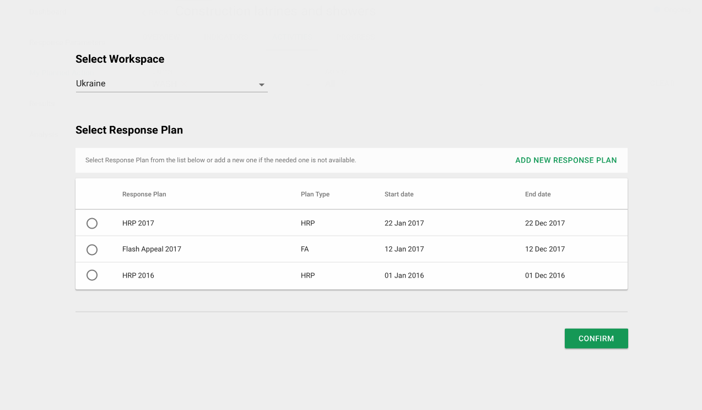
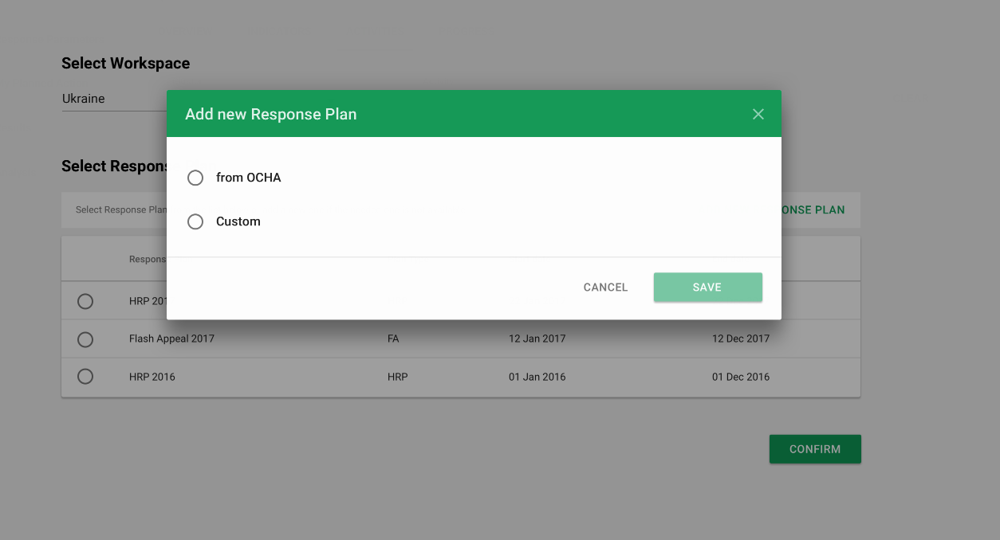
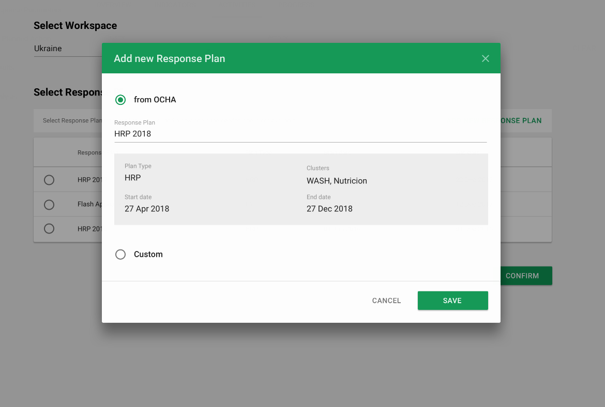
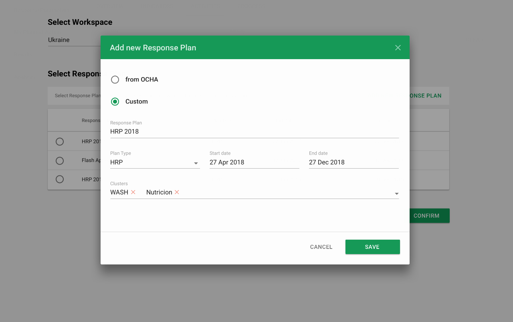

# Response Plans

### Selecting a Response Plan

In the context of the workspace the user has selected, they will have to always select a response plan, before they can proceed further. This ensures that the entire user interface is functioning and showing data for one response plan at a time only, and keeps reporting / data / setup for response plans not to overlap or interfere with each other.

If the response plan the IMO would like to work on, is not there, they can add a new response plan or select an existing one from OCHA Response Planning & Monitoring \(RPM\). See [OCHA integration](ocha-integration/README.md) for more details.

For Custom Projects, IMO can fill out Response Plan name, plan type, start date, end date, and select cluster\(s\) involved. They can select many or at least one for this response plan. 

&lt;**TDB get confirmation from Maciej on this&gt;**

